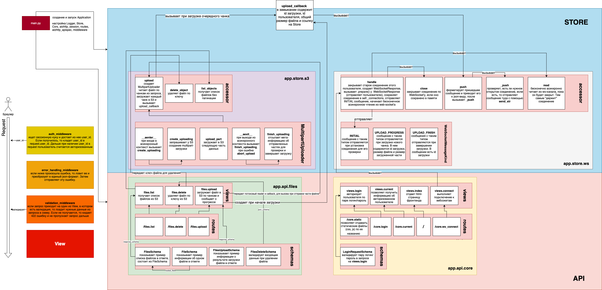

<h1 align="center"> Сервис загрузки фото, видео, документов различных форматов в S3 MINIO.
Реализована авторизация и регистрация на сервис.</h1>

<h1>Архитектура</h1>
<div class="container" style="text-align: center">
    <div class="row">
        <div class="col col-25 col-sm-25 col-md-25 col-lg-25 col-xl-25">
            
</div>
</div>
</div>

# Запуск приложения
# Поднять зависмости
 ```shell
make docker.up
```

# Подождать когда поднимутся зависимости и накатить миграции:
```shell
make migrate.up
make run.local
```

# Перейти по ссылке
 http://127.0.0.1:8888
1. Нажать зарегистрироваться и ввести логин и пароль
2. Рефрешнуть страницн и залогиниться[.env](..%2F..%2FAIOHTTP_SERVER_MY_TEST%2FLoader_KTS%2F.env)
3. Дальше можно загружать файлы

# Admin panel Minio тут (pass=minioadmin username=minioadmin) 
http://127.0.0.1:9000


# Планы на доработку:
- написать тесты
- причесывать к чистой архитектуре
- добавление работы не только access token , но так же работы с refresh token